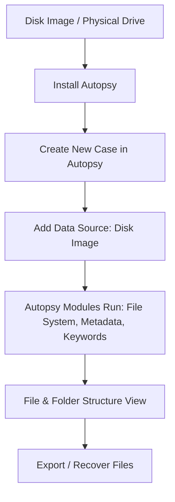

# Install Autopsy and Analyze the Disk File and Folder Configuration

## AIM
To install **Autopsy** and use it to analyze the disk’s file and folder configuration for forensic investigation.

## REQUIREMENTS
- **Operating System**: Windows 10/11, macOS, or Linux
- **Tools**:  
  - [Autopsy Digital Forensics Platform](https://www.autopsy.com/)  
  - Optional: Sleuth Kit CLI tools for deeper analysis
- **Test Data**: Disk image file (`.dd`, `.img`, `.E01`)

## ARCHITECTURE DIAGRAM

## DESIGN STEPS:
### Step 1:
Download Autopsy from the official website and install it on your system.

### Step 2:
Launch Autopsy and create a new case.

### Step 3:
Add your disk image or physical drive as the data source.

### Step 4:
Allow Autopsy to run its built-in ingest modules (file system analysis, hash lookup, keyword search, metadata extraction).

### Step 5:
View the file and folder hierarchy in the left-hand tree panel.

### Step 6:
Export or recover files if required for the investigation.

## PROGRAM(Windows)

1. Download Autopsy from autopsy.com.
2. Install and launch the application.
3. Select **New Case → Name your case → Choose case folder**.
4. Click Add **Data Source → Select Disk Image → Browse to file**.
5. Choose ingest modules (file system, metadata, hash lookup, keyword search).
6. Wait for processing to finish.
7. Explore file/folder structure in the navigation pane.
8.Export selected files for further examination.

## OUTPUT:
File and Folder Configuration Analysis Results

# RESULT:
Deleted files were successfully retrieved and analyzed using Autopsy.

